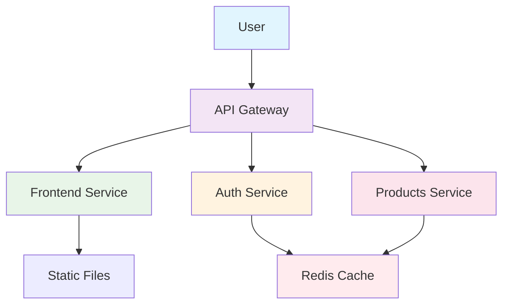

# 🚀 Microservices System with Kubernetes

A complete educational project demonstrating microservices architecture and Kubernetes deployment.

## 🏗️ System Architecture


## System Components:
 |Component |	Technology |	Port |	Description |
 |----------|--------|-------------|------------|
 |Frontend |	Vue.js + Nginx |	80 |	User Interface |
 |Auth Service |	Python FastAPI |	8001 |	Authentication management |
 |Products Service |	Node.js Express |	8002 |	Products management |
 |API Gateway |	Nginx |	80 |	Request routing & load balancing |
 |Redis |	Redis |	6379 |	Shared caching layer |
 
## 🎯 Microservices

#### 1. Auth Service (/auth-service)
   
  - Technology: Python FastAPI
  - Responsibility: User authentication and session management
  - Features: JWT-like tokens, Redis session storage
  - API Endpoints:
  
    - POST /login - User authentication
    - GET /users/{username} - Get user info

#### 2. Products Service (/products-service)

  - Technology: Node.js + Express
  - Responsibility: Product catalog management
  - Features: Redis caching, product inventory
  - API Endpoints:
  
    - GET /products - List all products
    - GET /products/{id} - Get product details

#### 3. Frontend Service (/frontend)
  - Technology: Vue.js + Nginx
  - Responsibility: User interface
  - Features: Responsive design, API integration

#### 4. API Gateway (/api-gateway)
  - Technology: Nginx
  - Responsibility: Request routing, load balancing
  - Features: URL rewriting, service discovery

## ⚙️ Prerequisites
#### Required Software:
  - Docker 20.10+
  - Kubernetes 1.25+ (or Minikube/Docker Desktop)
  - kubectl 1.25+
  - Git 2.30+

#### Optional (for local development):
  - Python 3.11+
  - Node.js 18+
  - Redis 7+

## 🚀 Installation & Setup
#### 1. Clone the Repository
```bash
  git clone https://github.com/your-username/microservices-k8s.git
  cd microservices-k8s
```
#### 2. Build Docker Images
```bash
  # Build all services
  docker build -t auth-service:latest auth-service/
  docker build -t products-service:latest products-service/
  docker build -t frontend:latest frontend/
  docker build -t api-gateway:latest api-gateway/
```
#### 3. Start Kubernetes Cluster
```bash
  # Using Minikube
  minikube start --driver=docker --memory=4096 --cpus=2
  
  # Or using Docker Desktop Kubernetes
  # Enable Kubernetes from Docker Desktop settings
```

## ☸️ Kubernetes Deployment
#### 1. Create Namespace
```bash
  kubectl apply -f k8s/namespace.yml
```
#### 2. Deploy Redis
```bash
  kubectl apply -f k8s/redis-deployment.yml
```

#### 3. Deploy Microservices
```bash
  # Deploy all services
  kubectl apply -f k8s/auth-deployment.yml
  kubectl apply -f k8s/products-deployment.yml
  kubectl apply -f k8s/frontend-deployment.yml
  kubectl apply -f k8s/gateway-deployment.yml
```

#### 4. Verify Deployment
```bash
  # Check all pods
  kubectl get pods -n microservices
  
  # Check services
  kubectl get services -n microservices
  
  # Check deployment status
  kubectl get deployments -n microservices
```

## 🧪 Testing
#### 1. Access the Application
```bash
  # Get gateway URL
  minikube service api-gateway -n microservices --url
  # Output: http://192.168.49.2:30000
```

#### 2. Test API Endpoints
```bash
  # Test auth service
  curl http://192.168.49.2:30000/auth/
  
  # Test products service
  curl http://192.168.49.2:30000/products/products
  
  # Test login
  curl -X POST http://192.168.49.2:30000/auth/login \
    -H "Content-Type: application/json" \
    -d '{"username":"admin","password":"password"}'
```
#### 3. Test Frontend

Open in browser: http://192.168.49.2:30000

## 📈 Scaling

Scale Auth Service
```bash
  kubectl scale deployment auth-service --replicas=3 -n microservices
```

Scale Products Service

```bash
  kubectl scale deployment products-service --replicas=3 -n microservices
```

Auto-scaling (HPA)
```bash
  # Create Horizontal Pod Autoscaler
  kubectl autoscale deployment auth-service --cpu-percent=50 --min=1 --max=5 -n microservices
```

## 📊 Monitoring

View Logs
```bash
# View auth service logs
kubectl logs -l app=auth-service -n microservices

# Follow logs in real-time
kubectl logs -f deployment/auth-service -n microservices
```

Resource Usage
```bash
# Check resource usage
kubectl top pods -n microservices

# Check node resources
kubectl top nodes
```

Port Forwarding for Debugging
```bash
# Access Redis directly
kubectl port-forward svc/redis-service 6379:6379 -n microservices

# Access auth service
kubectl port-forward svc/auth-service 8001:8001 -n microservices
```

## 🔧 Development & Debugging

Local Development
```bash
# Run auth service locally
cd auth-service
python -m venv venv
source venv/bin/activate
pip install -r requirements.txt
uvicorn app.main:app --reload --port 8001

# Run products service locally
cd products-service
npm install
npm start

# Run frontend locally
cd frontend
python -m http.server 8080
```

Kubernetes Debugging Commands

```bash
# Get detailed pod information
kubectl describe pod <pod-name> -n microservices

# Execute command in pod
kubectl exec -it <pod-name> -n microservices -- /bin/sh

# View service endpoints
kubectl get endpoints -n microservices
```

## 🤝 Contributing

Development Workflow

- Fork the repository
- Create a feature branch (git checkout -b feature/amazing-feature)
- Commit changes (git commit -m 'Add amazing feature')
- Push to branch (git push origin feature/amazing-feature)
- Open a Pull Request

Adding New Services

- Create service directory with Dockerfile
- Add Kubernetes deployment files
- Update API gateway configuration
- Update this README with service documentation

## 🐛 Troubleshooting

Common Issues:
Pods in CrashLoopBackOff:

```bash
kubectl describe pod <pod-name> -n microservices
kubectl logs <pod-name> -n microservices
```

Services not connecting:

```bash
# Check service DNS resolution
kubectl run debug-pod --image=busybox -it --rm -n microservices -- nslookup redis-service
```

Image pull errors:

```bash
# Load images to Minikube
minikube image load auth-service:latest
minikube image load products-service:latest
```

## 🙏 Acknowledgments

- Kubernetes community for excellent documentation
- Docker for containerization technology
- FastAPI and Express.js frameworks

## Happy Coding! 🚀

### For questions and support, please open an issue in the GitHub repository.
